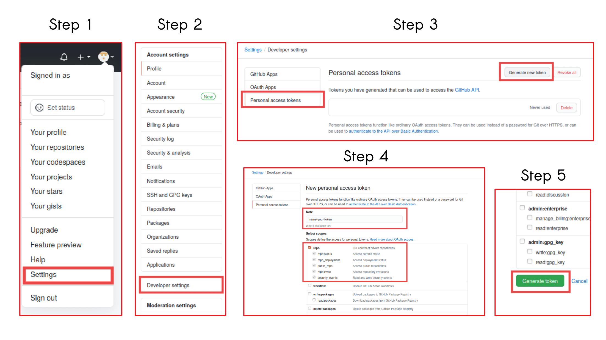
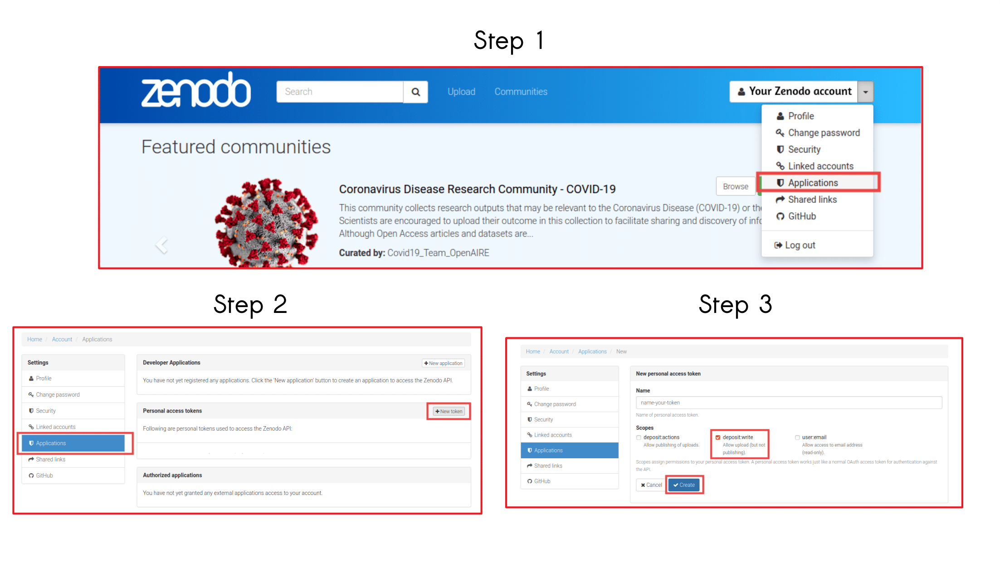
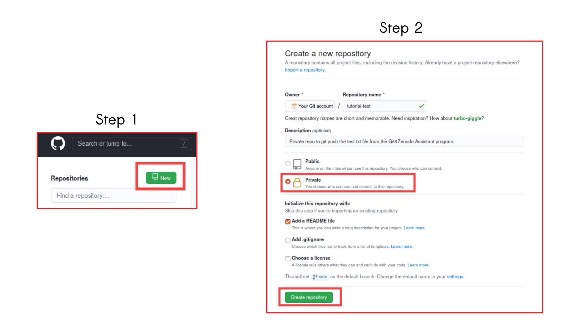

# Git&Zenodo Assistant
* * *

  
This repository contains the **Git&Zenodo Assistant** program, named ```tutorial.py```, and the ```requirements.sh``` file to install the python libraries needed to run the program. It also contains 4 directories, which correspond to the packages of the program (```git_assistant```, ```zenodo_assistant```); a ```metadata``` folder which contains .csv files with the controlled vocabulary of Zenodo's metadata; a ```test_tutorial``` folder with a ```test.txt``` file, to be used for the testing the program, and a ```images_tutorial``` with screenshots of the GitHub and Zenodo's websites to help you in creating your token.  
  
When running the **Git&Zenodo Assistant program**, you will see the main menu, which gives you five options to choose from:  
* By typing a, you will enter the **Git Tutorial**. In this section, you can learn how to git push a file by executing Git commands, without needing to type them so you can focus on learning about Git.
* By typing b, you will enter the **Zenodo Assistant**, which works with the Zenodo Rest API. You will not have to type any commands, but you will need to provide the location of your file and some basic information about your upload (the title of your work, its creators, etc).
* By typing c or d, you can see the links to the official **documentation** of Git and Zenodo respectively.
* By typing e, you can exit the program.  

To avoid problems while using the program remember to **install the requirements** by following the instructions below; **create your Git and/or Zenodo account** beforehand; and have your **authentication** information: (your username and password/token)

### Git clone
* * *

To get all the files in this repository and use the program, clone the file to your local machine or to the **ATLAS Virtual Machine** by opening the terminal and typing:  
  
```git clone https://github.com/Andreatugores/Scientific-computing.git```  
  
If you want to have this repository in your own GitLab account, **fork** the repository and then **clone** it with the https from your **own** account.  
  
Before running the program you should set your user name and email address. In order to do so, execute these commands:  
  
```git config --global user.name <yourname>```  
  
```git config --global user.email <youremail>```  
  
You need to do this only once when you use the ```--global``` option. Git will always use that information for anything you do on that system. If you do not want this to happend, type the commands without the ```--global``` part.
  
### Requirements
* * * 
  
This program was made to be runned in the **ATLAS Virtual Machine** terminal. It can also be executed locally, if the user has python3 installed, by opening a Linux Terminal and installing the requirements.  
   
The requirements in the ```requirements.sh``` file correspond to certain python libraries, which need to be installed in the **ATLAS Virtual Machine** too.  
   
To install the requirements, open the terminal and execute the following commands:  
   
Change directory:
    ``` cd git-zenodo-assistant```  
    
Run the requirements file to install the libraries: ``` sh requirements.sh ```  
  
After installing the requirements, execute the next command to open the Git&Zenodo Assistant to run the program:
    ```python3 tutorial.py```

### About GitHub
* * *
To push a file to your Git account, you can use your *GitLab* or *GitHub* account. If you do not have one already, create a [GitHub account](https://github.com/). It is expected that you have completed this step before running the **Git&Zenodo Assistant** program. Remember also to verify your email while creating your account.  
  
Note that to push a file to your **GitLab** account you will need to type your **username** and **password** at the end.  
  
Instead, to push a file to your **GitHub** account, you will need to type your **username** and paste a **valid token**, because the basic authentication using a password to Git is deprecated and will soon no longer work.  
  
To generate a token, login in to your **GitHub** account and go to [Settings/Developer settings/Personal access tokens](https://github.com/settings/tokens) and click ``` Generate new token```. You do not have to select all the scopes, just the ```repo``` scopes are needed to push your commit.

<CENTER>
    <h2> Steps to create your GitHub token  </h2>
    
</CENTER>

### About Zenodo
* * *
If you do not have a **Zenodo** account already, create a [Zenodo account](https://zenodo.org/). It is expected that you have completed this step before running the **Git&Zenodo Assistant** program to upload a file to **Zenodo**. Remember also to verify your email while creating your account.
  
Note that, to upload a file to your **Zenodo** account, you will need to type your **username** and paste a valid **token**.
  
To generate a token, login in to your **Zenodo** account and go to [Settings/Applications](https://zenodo.org/account/settings/applications/) and click ``` +New token```. You do not have to select all the scopes, just the ```deposit:write``` scope is needed to upload the file.

<CENTER>
    <h2> Steps to create your Zenodo token  </h2>
    
</CENTER>

### Testing the code
* * *
  
The folder ```test_tutorial``` contains a ```test.txt``` file which can serve you as a file to test the **Git&Zenodo Assistant** program:   

* By pushing this file to a new private repository in your GitHub or GitLab account that you can later delete.

* By uploading this file to Zenodo, which will not publish it. You can use some arbitrary data when the program asks you to fill the necessary information. After the uploading, you can delete the file in your: [Zenodo Deposit](https://zenodo.org/deposit) by selecting the file and then ```Delete```.

<CENTER>
    <h2> Steps to create a private Github repository  </h2>
    
</CENTER>

### Useful links
* * *
[1]  [GitHub](https://github.com/)  
[2]  [GitHub Personal Access Tokens](https://github.com/settings/tokens)  
[3]  [GitHub Official Documentation](https://docs.github.com)  
[4]  [Git Documentatio](https://git-scm.com/docs)   
[5]  [Zenodo](https://zenodo.org/)  
[6]  [Zenodo deposit](https://zenodo.org/deposit)  
[7]  [Zenodo API](https://developers.zenodo.org/)  
[8]  [Styde](https://styde.net/curso-de-git/) (Styde course about Git and GitHub in Spanish)
